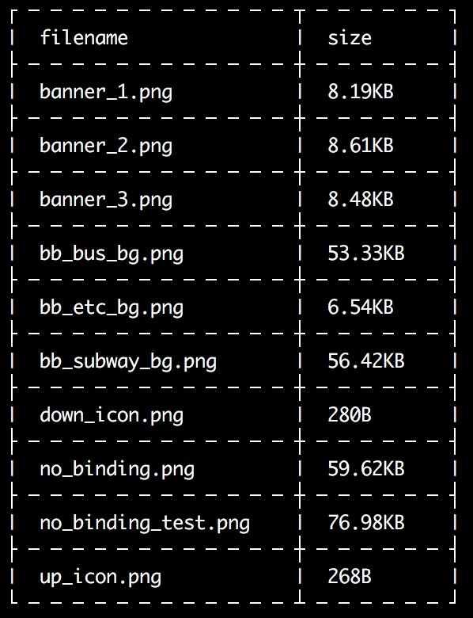
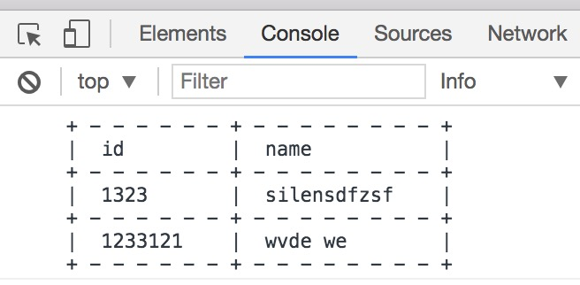

# painting-table
a library for painting a table in terminal or browser console.


# Install

> **npm install --save painting-table**

# Import

```js
const Table = require('painting-table')

//or

import Table from 'painting-table'
```

# Usage

```js
Table(tableData, options)
```

tableData是一个需要展示的数组列表，其中每项为一列数据，例如：
```js
tableData:
[{
    filename: 'banner1.png',
    size: '123B'
},{
    filename: 'banner2.png',
    size: '12KB'
}]
```

options选项为控制每一项需要显示的字段：
```js
options:
{
    excludes: ['filename'],
    includes: { filename: true, path: true, modify_time: false },
    rename: { filename: 'FILENAME' }
}
```
`excludes`字段是在数据中不显示那些字段，`includes`字段是在数据中只显示那些字段。两个字段是互斥的，有`includes`字段时会忽略掉`excludes`字段，这两个字段都支持数组和对象两种数据格式。

`rename`字段可以给标题字段进行重命名

处理后会返回能在terminal或浏览器控制台打印的结果

### Terminal


### Browser Console


# LICENSE

MIT